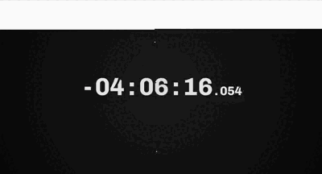

# Visual Countdown

Visual Countdown is a web-based timer that visualizes the amount of seconds left until a certain time of the day (like bedtime, or just the end of the day).

It works nicely as a new tab page.

## Installation

1. Clone the repository
2. Open `index.html` in your web browser

## Usage

- Click the timer to change when it considers the end of the day
- Click the background to toggle fullscreen

## Contributing

Contributions are welcome! Please feel free to submit a Pull Request.

## License

MIT